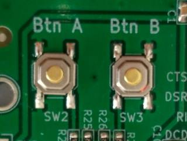

# test

<audio controls style=" width: 90%;">
 <source src="https://github.com/jontio/jontio.github.io/raw/master/jpic_assets/5.5dB-ebno-example.mp3" type="audio/mpeg">
Your browser does not support the audio element.
</audio>

<audio controls style=" width: 90%;">
 <source src="https://jontio.github.io/jpic_assets/5.5dB-ebno-example.mp3" type="audio/mpeg">
Your browser does not support the audio element.
</audio>

